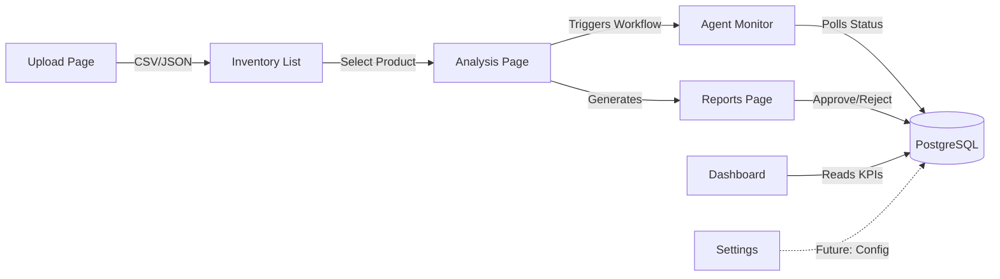

# AIM Platform — Page Review

A detailed breakdown of what each page does in the **Autonomous Inventory & Markdown Agent** platform.

---

## 1. Reports (`/reports`) — [Reports.jsx](file:///c:/Users/saura/OneDrive/Desktop/Projects/Autonomous%20Inventory%20&%20Markdown%20Agent/frontend/src/pages/Reports.jsx)

**Purpose:** Displays the finalized AI-generated executive markdown recommendations for reviewed products.

**What it does:**
- Fetches all analysis reports from `GET /reports` (stored in PostgreSQL via the `agent_reports` table)
- Renders each report as a card showing:
  - **Product name & ID**
  - **Risk level** (High / Medium / Low) — color-coded badge
  - **Current price** vs **Suggested price** (in ₹)
  - **Markdown percentage** recommended by the AI
  - **Approval status** (Pending / Approved)
- Users can **Approve** or **Reject** each report
  - Approve → calls `POST /report/{task_id}/approve` → persists to DB
  - Reject → removes the report from the UI (client-side only)
- **Export CSV** button downloads all reports as `executive_reports.csv` with columns: Product ID, Name, Risk Level, Current Price, Suggested Price, Markdown %, Status

**Data flow:** `Analysis page runs agents → backend saves report to DB → Reports page fetches & displays`

---

## 2. Agent Monitor (`/monitor`) — [AgentMonitor.jsx](file:///c:/Users/saura/OneDrive/Desktop/Projects/Autonomous%20Inventory%20&%20Markdown%20Agent/frontend/src/pages/AgentMonitor.jsx)

**Purpose:** Real-time monitoring dashboard for all 6 AI agents and their MCP tool call history.

**What it does:**
- Polls `GET /monitor-stats` every **2 seconds** to get live agent state from the `system_state` DB table
- Displays **6 agent cards** in a grid:

  | Agent | Icon Color | Role |
  |-------|-----------|------|
  | Inventory Agent | Blue | Stock level analysis |
  | Sales Analysis Agent | Purple | Demand forecasting |
  | SQL Agent | Yellow | Database queries |
  | Pricing Agent | Green | Markdown optimization |
  | Risk Analysis Agent | Orange | Risk assessment |
  | Report Agent | Pink | Report generation |

- Each card shows:
  - **Status badge** (Idle / Running / Completed / Failed) — with animated spinner when running
  - **Last Run** — timestamp (converted from server UTC to local 12-hour AM/PM format)
  - **Duration** — how long the agent took (in seconds)
  - **Status message** — e.g. "Processed successfully" or "Ready"
- **MCP Tool Call History** table at the bottom shows the last 10 tool calls with timestamp, tool name, status, and duration

**Data flow:** `Analysis triggers workflow → backend updates system_state in DB per agent step → Monitor polls & displays`

---

## 3. AI Analysis Workflow (`/analyze`) — [Analysis.jsx](file:///c:/Users/saura/OneDrive/Desktop/Projects/Autonomous%20Inventory%20&%20Markdown%20Agent/frontend/src/pages/Analysis.jsx)

**Purpose:** The core AI execution hub — triggers the LangGraph multi-agent pipeline and streams results live.

**What it does:**
- Fetches inventory from `GET /inventory` to populate a **product selector dropdown**
- User selects a product and clicks **Run Analysis**
- Sends `POST /analyze` with the selected product data → receives a `task_id`
- Opens an **SSE (Server-Sent Events)** connection to `GET /agent-status/{task_id}`
- Displays two panels:
  - **Agent Pipeline** (left) — numbered list of the 6 agents in execution order
  - **Live Stream** (right) — terminal-style log showing real-time agent completions with timestamps
- Timestamps come from the server (ISO UTC) and are converted to local 12-hour format — **matching the Agent Monitor page exactly**
- When `[END]` event arrives, the stream closes and the button re-enables
- Analysis state (running, logs, taskId) is persisted in **sessionStorage** so it survives page navigation

---

## 4. Dashboard (`/`) — [Dashboard.jsx](file:///c:/Users/saura/OneDrive/Desktop/Projects/Autonomous%20Inventory%20&%20Markdown%20Agent/frontend/src/pages/Dashboard.jsx)

**Purpose:** Real-time command center providing a high-level overview of operations.

**What it does:**
- Fetches KPIs from `GET /dashboard-stats` and recent reports from `GET /reports`
- Auto-refreshes every **5 seconds**
- Displays **4 KPI cards** with colored left borders:
  - **Total Products** — count of all products in DB
  - **Out of Stock** — products with 0 stock
  - **Active Agents** — currently running agent tasks
  - **Total Reports** — count of generated reports
- **Recent Analyses** table — last 5 reports with product ID, name, and approval status
- **Agent Activity** feed — last 4 reports shown as activity cards with contextual icons:
  - High risk → red alert icon
  - Has markdown → blue trending-down icon
  - Default → green package icon

---

## 5. Inventory Management (`/inventory-list`) — [InventoryList.jsx](file:///c:/Users/saura/OneDrive/Desktop/Projects/Autonomous%20Inventory%20&%20Markdown%20Agent/frontend/src/pages/InventoryList.jsx)

**Purpose:** Full CRUD management for all tracked products.

**What it does:**
- Fetches all products from `GET /inventory`
- **Search bar** filters by product ID, name, or category (client-side)
- **Data table** with columns: Product ID, Name, Category, Stock, Cost, Price, Actions
  - Stock quantity < 10 is highlighted in red (destructive color)
- **Add Item** button opens a modal form with 3 sections:
  - Product Information (ID, Name, Category)
  - Inventory (Stock Quantity, Monthly Sales)
  - Pricing (Unit Cost, Selling Price)
- **Edit** button (pencil icon) → opens same modal pre-filled with existing data
- **Delete** button (trash icon) → confirmation prompt → calls `DELETE /inventory/{product_id}`
- Create → `POST /inventory`, Update → `PUT /inventory/{product_id}`

---

## 6. Upload Inventory Data (`/upload`) — [InventoryUpload.jsx](file:///c:/Users/saura/OneDrive/Desktop/Projects/Autonomous%20Inventory%20&%20Markdown%20Agent/frontend/src/pages/InventoryUpload.jsx)

**Purpose:** Bulk import products via CSV or JSON file upload.

**What it does:**
- **Drag & drop zone** — accepts CSV or JSON files (max 10MB)
- Also supports click-to-browse file selection
- Shows the **expected CSV format** with column headers and example row
- Once a file is selected, displays:
  - File name and size (in KB)
  - **Process** button to upload
- Calls `POST /upload-inventory` with the file as multipart form data
- Backend parses the file, validates each row against `InventoryUploadRow` schema, and saves to DB
- On success → shows green success banner with count → auto-redirects to Inventory List after 1.5s

---

## 7. Settings (`/settings`) — [Settings.jsx](file:///c:/Users/saura/OneDrive/Desktop/Projects/Autonomous%20Inventory%20&%20Markdown%20Agent/frontend/src/pages/Settings.jsx)

**Purpose:** Configuration panel for tuning agent behavior.

**What it does:**
- **Maximum Allowed Markdown (%)** — number input (default: 30%) — caps how aggressive agents can be with discount suggestions
- **Default Risk Threshold** — dropdown select with options:
  - Conservative / Moderate / Aggressive
- **Save Changes** button (currently UI-only, no backend persistence yet)

> [!NOTE]
> Settings are currently frontend-only and do not persist to the backend. They reset on page reload.

---

## 8. Help & Documentation (`/help`) — [Help.jsx](file:///c:/Users/saura/OneDrive/Desktop/Projects/Autonomous%20Inventory%20&%20Markdown%20Agent/frontend/src/pages/Help.jsx)

**Purpose:** In-app documentation explaining how to use the platform.

**What it does:**
- **About section** — describes the AIM platform as a LangGraph-powered multi-agent retail AI system
- **How to Use** — 4-step guide cards:
  1. Upload Inventory (CSV/JSON)
  2. View Inventory (check stock & pricing)
  3. Run Analysis (trigger AI agents)
  4. Monitor & Approve (watch agents, review reports)
- **What to Expect** — bullet points covering automated insights, real-time tracking, and live dashboard updates

---

## Architecture Flow

